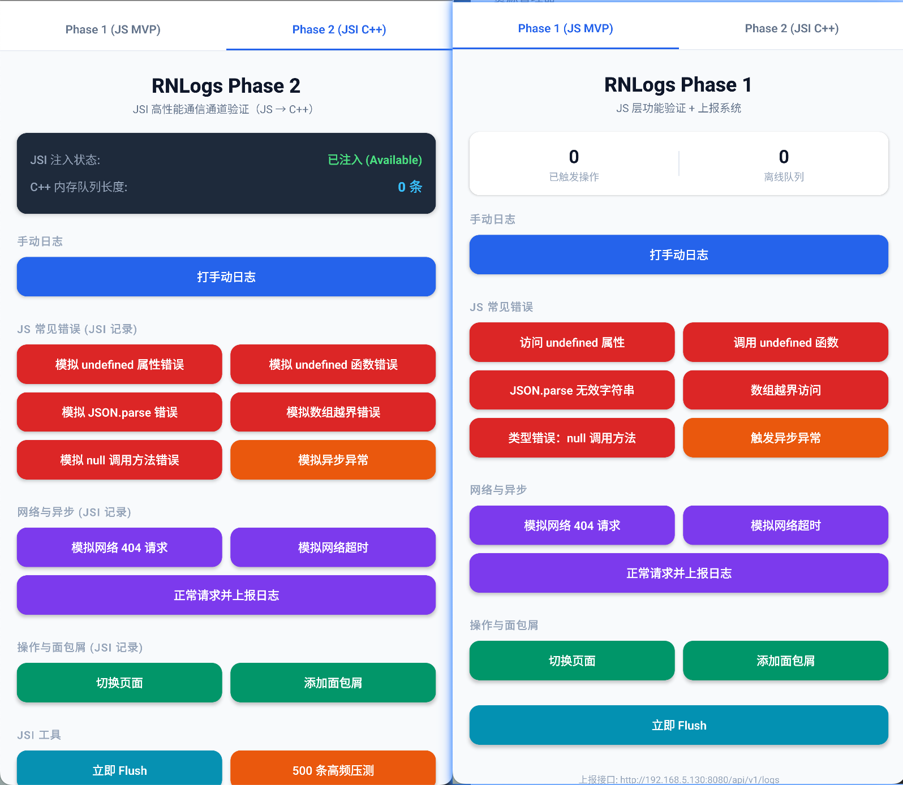

# RNlogss - React Native 智能日志采集与上报系统 (Phase 1, 2 & 4)

`RNlogss` 是一个针对 React Native 应用设计的高性能、高可靠性的日志采集与自动上报 SDK 及其实例工程。目前已完成 **Phase 1（JS 业务层监控与上报）**、**Phase 2（TurboModule + JSI 高性能 C++ 桥接通道）** 及 **Phase 4（崩溃捕获与上报、Protobuf 序列化、gRPC 对接与生产级性能打磨）** 的核心功能建设与双端联调。

<p align="center">
  
</p>

---

## 🚀 项目概览 (Project Overview)

在 React Native 应用中，传统 Bridge 架构在传输高频、大量的日志数据时容易因序列化和异步线程排队导致主线程卡顿（Jank）。本项目通过双阶段及生产级演进，实现了一套既有完备业务捕获能力，又有高性能原生通道的日志引擎：

*   **Phase 1（JS 侧业务层）**：负责全局异常劫持、网络请求拦截、面包屑操作链追踪和设备/性能指标采集，提供内存缓冲和离线持久化重试。
*   **Phase 2（C++ 侧原生层）**：通过 JSI（JavaScript Interface）机制，在 JS 引擎全局直接注入 `__rnlogsInternal` 原生宿主对象（Host Object），绕过传统 Bridge，实现微秒级（μs）同步写入 C++ 原生高速内存队列。
*   **Phase 4（生产级打磨）**：
    *   **崩溃捕获（Crash Handling）**：Android 端捕获 `SIGSEGV`、`SIGABRT` 等致命信号，iOS 端集成 `PLCrashReporter`，并在冷启动时实现崩溃数据的异步还原与优先上报。
    *   **手写 Protobuf 序列化**：基于第一性原理，手写极轻量 C++ Varint / Length-delimited 字段编码器，脱离庞大的外部 pb 环境依赖。
    *   **gRPC 帧对接（application/grpc）**：应用层封装标准的 gRPC 5 字节数据包头部，使用双端原生 HTTP 客户端直连 gRPC 收集后端。
    *   **内存与落盘打磨**：引入 `ArenaAllocator` 定长缓冲区实现 `std::string_view` 零堆分配日志缓冲；批量日志合并后一次性调用 `zlib` 压缩，并采用自包含的 AES-256 加密落盘，实现极限的安全与效率。

---

## 📦 核心特性 (Key Features)

*   **异常自动捕获 (Exception Collector)**：自动捕获 React Native 中的 JS 未捕获异常（通过全局劫持 `ErrorUtils`）以及未处理的 Promise Rejections。
*   **网络拦截监控 (API Collector)**：自动监控并采集 `fetch` 和 `XMLHttpRequest` 请求，包含请求路径、方法、HTTP 状态码、持续时长及错误原因。
*   **用户轨迹追踪 (Operation Collector)**：记录面包屑（Breadcrumbs）日志，包括路由跳转（Navigation）和用户自定义行为，同步推入 C++ 端的信号安全环形缓冲。
*   **信号级崩溃捕捉 (Hardware Crash Handler)**：
    *   **Android**：拦截 `SIGSEGV`、`SIGABRT`、`SIGFPE`、`SIGILL`、`SIGBUS`，利用信号安全（Async-Signal-Safe）函数同步抓取面包屑和未落盘日志并物理写盘，再还原抛回原信号。
    *   **iOS**：集成 `PLCrashReporter` 拦截硬崩溃，在下次冷启动时反序列化解析并生成标准 Crash 报告。
*   **零堆分配日志缓冲 (Arena Allocator)**：在 C++ 队列中使用定长预分配内存池，日志仅以 `std::string_view` 视窗存储，消除高频 JSI 写入下的 `malloc/free` 内存碎片。
*   **落盘批量加密压缩 (Bulk Compression & Encrypt)**：在队列满或主动 Flush 时，将 batch 合并为多行大文本，调用系统级 `zlib` 压缩，并基于 AES-256-CBC 进行整包混淆加密，规避敏感日志泄露，降低 90% 的 CPU 开销。
*   **双上报通道 (JSON & gRPC)**：
    *   普通 Endpoint：上报符合 Phase 1 & 2 协议的普通 JSON 格式数据。
    *   gRPC Endpoint：自动提取 Protobuf 字节，拼接 gRPC 5 字节头（1字节压缩标志 + 4字节大端包长），通过 `application/grpc` 请求直连标准 gRPC 后端，免于引入庞大臃肿的 gRPC 运行库。

---

## 📂 项目目录结构 (Directory Structure)

```text
RNlogss/
├── cpp/                      # C++ 原生层源码 (Phase 2 & 4 新增)
│   ├── core/                 # C++ 核心逻辑
│   │   ├── LogQueue.cpp             # 支持 Arena 缓冲、批量加密压缩与异步磁盘加载的队列
│   │   ├── LogQueue.h               # 队列接口定义
│   │   ├── BreadcrumbTracker.cpp    # 原子无锁信号安全的面包屑环形队列
│   │   ├── BreadcrumbTracker.h      # 面包屑接口定义
│   │   ├── CrashReporter.cpp        # 信号安全的崩溃数据写入与下次启动恢复整理
│   │   ├── CrashReporter.h          # 崩溃文件接口定义
│   │   ├── CrashHandlerAndroid.cpp  # Android sigaction 信号级致命崩溃拦截器
│   │   ├── CrashHandlerAndroid.h    # 信号拦截器接口定义
│   │   ├── LogSerializer.cpp        # 纯 C++ 手写的自包含轻量级 Protobuf 编码器
│   │   ├── LogSerializer.h          # 序列化接口定义
│   │   └── ArenaAllocator.h         # 零堆分配内存池分配器
│   ├── jsi/                  # JSI 绑定映射层
│   │   ├── RNLogsJSIBinding.cpp     # 将 HostFunction 注入 JS 运行时的绑定实现 (含崩溃接口)
│   │   └── RNLogsJSIBinding.h       # 绑定对象接口定义
│   ├── utils/                # 加密压缩辅助工具
│   │   ├── Compression.cpp          # 引入系统 <zlib.h> 实现的真实批量 Gzip 压缩解压
│   │   ├── Compression.h            # 压缩接口定义
│   │   ├── Crypto.cpp               # 自包含的纯 C++ AES-256-CBC 对称加解密引擎
│   │   └── Crypto.h                 # 加密接口定义
│   └── tests/                # 本地 C++ 核心单测套件 (脱离 JSI 框架，百分百本地一键运行)
│       ├── CMakeLists.txt           # 测试编译配置
│       └── run_tests.cpp            # 单测实现 (覆盖压缩、加密、PB 编码)
├── src/                      # RNLogs SDK 核心源码
│   ├── index.ts              # SDK 导出入口
│   ├── RNLogsModule.ts       # SDK 主控类 (同步将面包屑灌入 C++ Breadcrumb 缓冲)
│   ├── types.ts              # 数据结构与类型定义
│   ├── specs/                # Codegen 协议及全局类型声明
│   │   └── NativeRNLogs.ts          # __rnlogsInternal 全局变量声明与新增崩溃接口定义
│   └── collectors/           # 自动日志收集器
├── android/                  # Android 原生工程
│   └── app/src/main/jni/     # C++ 编译与加载配置
│       ├── CMakeLists.txt           # 追加了 Phase 4 的所有新增 C++ 源码
│       └── OnLoad.cpp               # JNI 入口 (初始化 CrashReporter 与 注册信号拦截)
├── ios/                      # iOS 原生工程
│   ├── Podfile                      # 引入 pod 'PLCrashReporter' 依赖
│   └── RNlogss/
│       ├── RNLogsModule.h           # iOS 端 Bridge Module 定义
│       ├── RNLogsModule.mm          # 桥接实现，支持 iOS 挂接 JSI 与启动 PLCrashReporter
│       ├── CrashHandlerIOS.h        # iOS 崩溃拦截单例定义
│       └── CrashHandlerIOS.mm       # 崩溃检测、提取与格式化
├── App.tsx                   # 功能验证与交互测试沙盒页面 (追加 C++ 崩溃与消费控制)
├── package.json              # 项目配置文件与依赖项
└── tsconfig.json             # TypeScript 配置
```

---

## 🛠️ 项目运行指南 (Getting Started)

### 1. 准备工作

请确保您的本地开发环境已安装以下工具：
*   **Node.js** >= 20
*   **Yarn** 或 **npm**
*   **Android NDK** (编译 JSI C++ 原生库需要，推荐 23+)
*   **CMake** (用于 Android NDK 原生编译)
*   **CocoaPods** (仅 macOS/iOS 构建需要)

### 2. 安装依赖

在项目根目录下执行以下命令安装项目所需的 JS 依赖：

```bash
npm install
# 或者
yarn install
```

如需编译 iOS 端，请先安装 CocoaPods 依赖包：
```bash
cd ios && pod install && cd ..
```

### 3. 运行项目

首先，启动 React Native 编译服务器 Metro：

```bash
npm start
```

保持 Metro 窗口开启，新建终端并运行相应的平台客户端：

#### 运行 Android

```bash
npm run android
```

#### 运行 iOS

```bash
npm run ios
```

---

## 📖 快速上手使用 (Usage)

### 1. 初始化 SDK

在应用的入口文件（例如 `index.js` 或 `App.tsx` 顶部）进行初始化。在初始化时，SDK 会通过 `NativeModules.RNLogsModule.install()` 同步完成 JSI 的全局挂载，并自动开启崩溃处理：

```typescript
import { RNLogs, LogLevel } from './src';
import { Platform } from 'react-native';

RNLogs.init({
  environment: 'production',         // 环境区分
  release: '1.0.0',                  // 版本号
  maxBatchSize: 10,                  // 满 10 条日志即触发上报
  flushIntervalMs: 5000,             // 距离上次上报满 5 秒即强制上报
  device: {
    deviceId: 'device-unique-id',
    platform: Platform.OS,
    osVersion: Platform.Version?.toString() ?? 'unknown',
  },
  upload: {
    // 若端点 URL 中包含 "grpc" 字符串，SDK 将自动采用 application/grpc 及 pb 二进制帧进行上报
    endpoint: 'https://your-log-server.com/grpc/v1/logs', 
    maxRetries: 3,                  // 上报失败最大重试次数
    retryDelayMs: 1000,             // 重试间隔时间 (ms)
    batchSize: 10,                  // 单次上报的最大批次大小
  },
});
```

### 2. 使用 C++ 崩溃和面包屑功能

当需要使用底层功能时，可以直接通过 `global.__rnlogsInternal` 接口进行同步写入：

```typescript
import { isJsiAvailable } from './src/specs/NativeRNLogs';

if (isJsiAvailable()) {
  // 1. 同步写入面包屑，以保证硬件崩溃瞬间可用于现场分析
  global.__rnlogsInternal.addBreadcrumb('user_tapped_pay', 'action');
  
  // 2. 检查是否有先前挂起的崩溃报告（在冷启动时）
  const hasCrash = global.__rnlogsInternal.hasPendingCrashReport();
  if (hasCrash) {
      // 3. 读取崩溃报告 JSON 并清空缓存
      const crashReport = global.__rnlogsInternal.consumeCrashReport();
      console.log('先前发生过崩溃:', JSON.parse(report));
  }
}
```

---

## 🧪 功能验证测试页面 (Test Sandbox)

项目在 `App.tsx` 中实现了一个功能完善的双 Tab 测试沙盒面板，在 **Tab 2: Phase 2 (JSI C++)** 栏目下，我们追加了 Phase 4 的测试动作：

1.  **💥 触发 C++ Native Crash**：通过 JSI 调用 native 制造一个致命的解引用空指针错误（`SIGSEGV`）。这会引发应用立即闪退，同时在后台无声、安全地将当时的面包屑与内存积压日志写入私有崩溃文件。
2.  **🔍 查看并消费挂起的崩溃报告**：重新开启 App 后，点击此按钮可立即读取上一次崩溃的详细上下文 JSON，包含发生时的硬件信号名、崩溃描述、面包屑历史序列等，并将文件清理，保证不重复处理。
