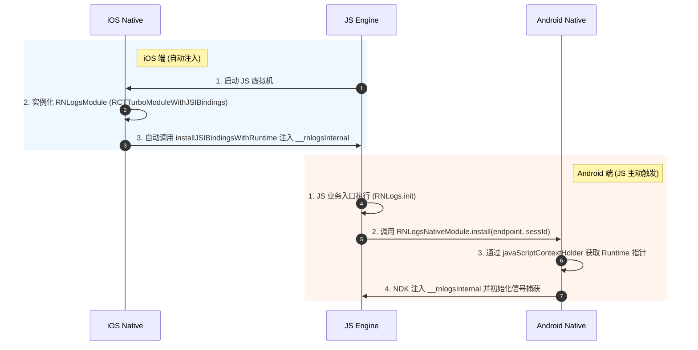

# React Native JSI 独立封装与新架构 (Bridgeless) 编译排查指南

本指南用于总结 `react-native-rnlogs` SDK 在独立封装为 Packages 时，遇到的新架构 (Bridgeless) 下 JSI 注入失效，以及后续编译死锁问题的排查与解决方法。主要用于后续开发及维护时的核对与避坑。

---

## 1. 整体架构与注入时序

在新架构 Bridgeless 模式下，由于传统的 Bridge 已经被彻底移除，JS 与 Native 两端通过 JSI 的直接绑定时序在双端存在差异：



---

## 2. 常见问题排查决策树

当遇到 `JSI 注入状态未挂载` 或 `Android 编译报错` 时，可遵循以下流程进行排查：

```mermaid
flowchart TD
    Start([开始排查]) --> Q1{编译是否通过?}
    
    Q1 -- 否 --> Q2{错误类型是?}
    Q2 -- jsi/jsi.h 找不到 --> Fix_Prefab[CMake中链接ReactAndroid::jsi<br>并确认build.gradle开启prefab]
    Q2 -- add_subdirectory 路径不存在 --> Fix_Codegen[确认 build.gradle 应用了 com.facebook.react 插件<br>强清 Gradle Daemon: ./gradlew --stop && ./gradlew clean]
    Q2 -- static/shared STL 冲突 --> Fix_STL[在 build.gradle 的 arguments 中添加 -DANDROID_STL=c++_shared]
    Q2 -- minSdkVersion 冲突 --> Fix_MinSdk[将子库 build.gradle 的 minSdkVersion 提升至 24]
    
    Q1 -- 是 --> Q3{JS 端 NativeModule 是否为 undefined?}
    Q3 -- 是 --> Fix_ReactModule[在 Android 原生类上添加 @ReactModule(name = 'RNLogsModule') 注解]
    Q3 -- 否 --> Q4{JSI __rnlogsInternal 是否未挂载?}
    Q4 -- 是 (Android) --> Fix_Context[移除 catalystInstance, 改为直接通过 javaScriptContextHolder 获取]
    Q4 -- 是 (iOS) --> Fix_iOS[使原生类遵守 RCTTurboModuleWithJSIBindings<br>在 installJSIBindingsWithRuntime 中做 JSI 注入]
    
    Fix_Prefab & Fix_Codegen & Fix_STL & Fix_MinSdk & Fix_ReactModule & Fix_Context & Fix_iOS --> Verify([运行验证: JSI 注入成功])
```

---

## 3. 核心配置文件检查清单 (Checklist)

为避免日后在本地或发布 npm 时出错，请在发布前核对以下四项配置：

### 3.1 库 package.json 配置
对于支持新架构 JSI 的库，`package.json` **必须** 声明 `codegenConfig`，以便 React Native 能够在构建主项目时为此库生成 CMake 描述文件：
```json
{
  "name": "react-native-rnlogs",
  "version": "1.0.1",
  "codegenConfig": {
    "name": "RNLogsSpec",
    "type": "modules",
    "jsSrcsDir": "src"
  }
}
```

### 3.2 库 Android build.gradle 配置
1. 必须应用 `com.facebook.react` 插件以激活 Codegen 任务图挂载。
2. 必须启用 `prefab true`。
3. `minSdkVersion` 必须为 `24`（React Native 0.80+ 的最低要求）。
4. 必须声明 `-DANDROID_STL=c++_shared`：
```groovy
apply plugin: "com.android.library"
apply plugin: "kotlin-android"
apply plugin: "com.facebook.react" // 1. 必加插件

android {
    buildFeatures {
        prefab true // 2. 开启 prefab 共享依赖
    }
    defaultConfig {
        minSdkVersion 24 // 3. 提升到 24 避免链接拒绝
        externalNativeBuild {
            cmake {
                cppFlags "-O3 -frtti -fexceptions -Wall"
                arguments "-DANDROID_STL=c++_shared" // 4. 指定共享 STL
            }
        }
    }
}
```

### 3.3 库 CMakeLists.txt 配置
1. 必须声明 `find_package(ReactAndroid REQUIRED)`。
2. 头文件包含目录应当精炼，无需在 C++ 源码中使用大跨度相对路径（如 `../../../../../`）。
3. 必须在 `target_link_libraries` 中链接 `ReactAndroid::jsi`：
```cmake
find_package(ReactAndroid REQUIRED)

target_include_directories(
    react-native-rnlogs
    PRIVATE
    ${CMAKE_CURRENT_SOURCE_DIR}/../../../../cpp/jsi
    ${CMAKE_CURRENT_SOURCE_DIR}/../../../../cpp/core
)

target_link_libraries(
    react-native-rnlogs
    ReactAndroid::jsi # 必须链接 JSI 动态库
    log
    z
)
```

### 3.4 库发布拦截 (.npmignore)
由于 Gradle 和 C++ 编译会生成海量包含“硬链接（Hard links）”的临时缓存，直接发布将导致 npm 官网拒绝上传（415 报错）。
库的根目录下 **必须** 包含 `.npmignore` 并写入以下过滤：
```ini
# 排除 C++ 与 Gradle 构建缓存
android/build/
android/.cxx/

# 排除本地测试压缩包
*.tgz
```

---

## 4. 总结与反思

* **缓存污染导致死锁**：在物理删除构建目录（如 `rm -rf build`）后，如果未停止 Gradle Daemon，其驻留内存会认为编译任务仍然是最新的（`UP-TO-DATE`）从而跳过代码生成，最终引发 CMake add_subdirectory 路径缺失的“死锁”现象。
* **终极重置命令**：若遇到难以解释的原生编译冲突，可一键执行以下命令打破死锁：
  ```bash
  # 停止 Gradle 守护进程并彻底清空物理构建缓存
  ./gradlew --stop && rm -rf android/app/build android/app/.cxx android/.gradle && ./gradlew clean
  ```
